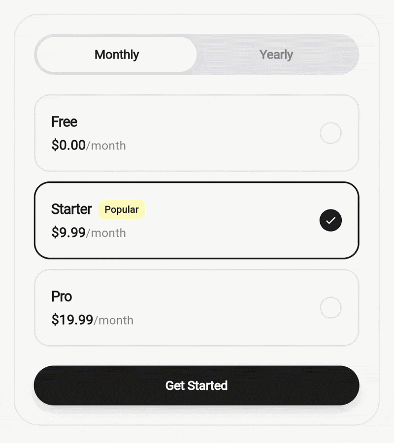
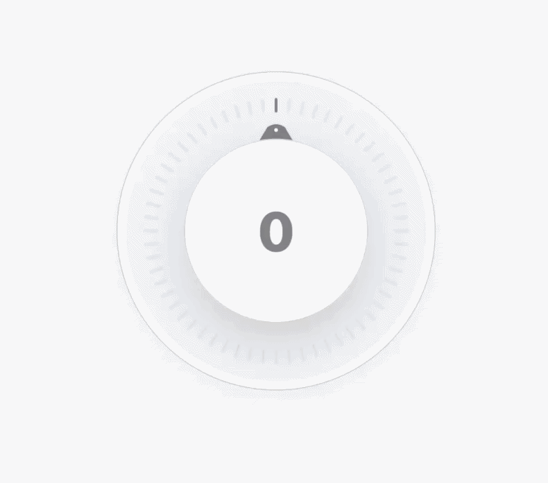
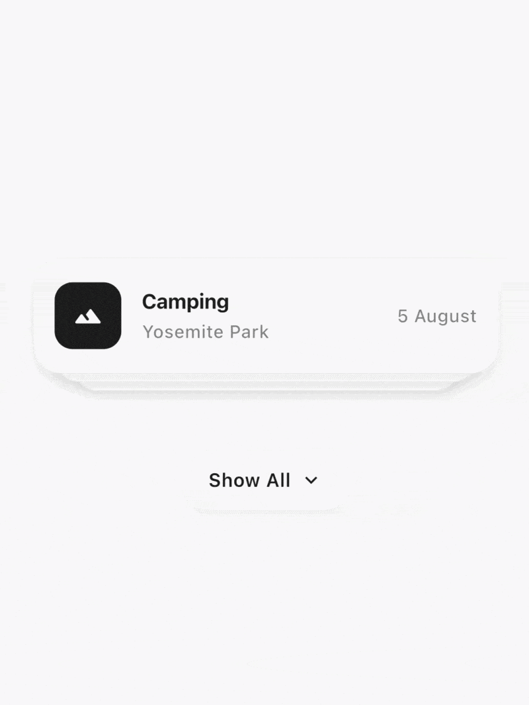
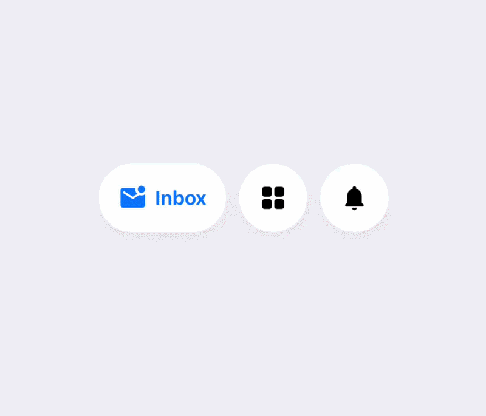
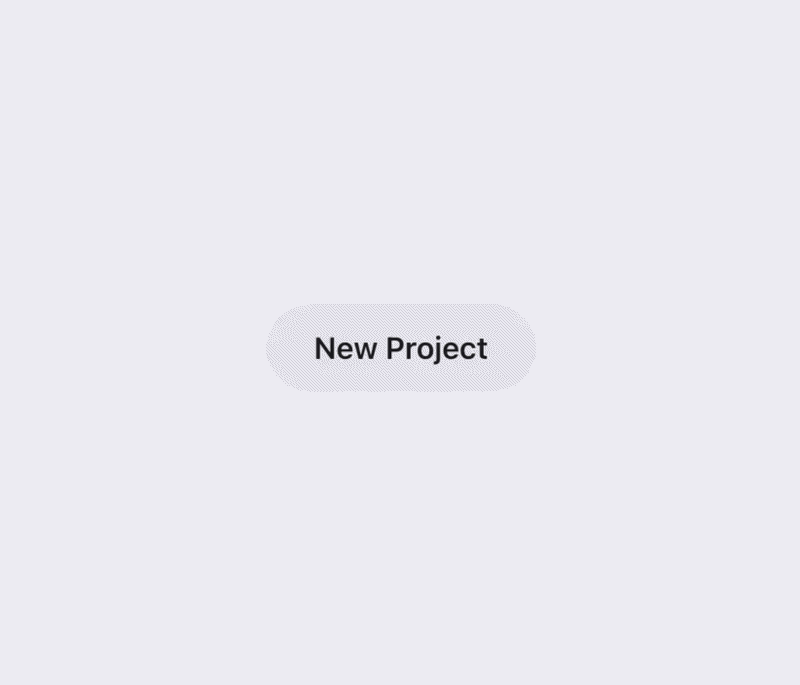

# Portal Labs

A specialized collection of **high-performance, dependency-free** Flutter UI components and advanced interactions. Built exclusively with vanilla Flutter and Dart to ensure maximum portability and long-term stability.

## Design Philosophy

The Portal Labs architecture is centered around three core pillars: **performance**, **portability**, and **visual excellence**. By adhering to a strict "zero-dependency" technical policy, we ensure that every component remains lightweight and compatible across all Flutter-supported platforms.

### Technical Constraints

To maintain a clean architecture and eliminate overhead, this repository follows these engineering standards:

*   **SDK-Only Foundation**: Components are developed using only core Flutter and Dart libraries.
*   **Internal Utilites**: Formatting, text measurement, and specialized date logic are centralized in [PortalUtils](/lib/src/common/portal_utils.dart) to avoid external packages like `intl`.
*   **Custom Design System**: Icons and typography leverage system defaults and Material Design standards, removing the need for `google_fonts` or third-party icon sets.
*   **Native Animation Engine**: Complex physics and mechanical transitions (e.g., 3D flips, magnetic snapping) are implemented using standard `AnimationController` and `Tween` sequences.

This strategy makes every component **instantly portable**—allowing developers to integrate the full library or copy individual source files without managing external versioning conflicts.

## Component Library

| Component | Description | Technical Scope | Location |
| :--- | :--- | :--- | :--- |
| **[Reveal & Copy](#reveal--copy)** | Secure data masking with scramble reveal and clipboard animation. | Interaction | `/lib/src/reveal_and_copy/` |
| **[Modern Weight Picker](#modern-weight-picker)** | Precision scrollable ruler with magnetic snapping and haptic feedback. | Numeric Input | `/lib/src/weight_picker/` |
| **[Premium Choice Chips](#premium-choice-chips)** | Animated multi-selection system with flying media transitions. | Selection | `/lib/src/premium_choice_chips/` |
| **[Journal Navigation](#journal-navigation)** | Vertical date-based navigation with 3D flip counters and snapping transitions. | Navigation | `/lib/src/journal_navigation/` |
| **[Card Splitting Accordion](#card-splitting-accordion)** | Dynamic grouping interaction with physical splitting and variable corner radii. | Layout | `/lib/src/card_splitting_accordion/` |
| **[Adaptive Slider](#adaptive-slider)** | Value-aware gradient slider with real-time color morphing. | Interaction | `/lib/src/adaptive_slider_interaction/` |
| **[Range Selection Slider](#range-selection-slider)** | Premium bi-directional range selector with mechanical Odometer-style counters and manual input support. | Selection | `/lib/src/range_selection_slider/` |
| **[Subscription Picker](#subscription-picker)** | High-fidelity pricing selector with minimalist monthly/yearly toggle logic. | Selection | `/lib/src/subscription_pricing_picker/` |
| **[Media Collapsible View](#media-collapsible-view)** | Reels-inspired video background with dynamic collapsible interactive sheet. | Interaction | `/lib/src/media_collapsible_view/` |
| **[High-Fidelity Knob Slider](#high-fidelity-knob-slider)** | Premium tactile knob with mathematical delta tracking and mechanical reel digits. | Interaction | `/lib/src/knob_slider/` |
| **[Card Stack Interaction](#card-stack-interaction)** | Premium chronological card stack with symmetric expansion and high-fidelity transitions. | Interaction | `/lib/src/card_stack_interaction/` |
| **[Discrete Tabs](#discrete-tabs)** | Minimalist pill expanding tabs with aesthetic bounce, shimmer text, and managed state. | Interaction | `/lib/src/discrete_tabs/` |
| **[Split Button Interaction](#split-button-interaction)** | Premium morphing action menu with synchronized action slide, elastic pop bounce, and motion blur emergence. | Navigation | `/lib/src/split_button_interaction/` |

---

### Reveal & Copy


A specialized interaction designed for the secure presentation and acquisition of sensitive data (e.g., credentials, financial accounts).

#### Key Features

*   **Secure Masking**: Configurable character masking with an automated shimmer reveal effect.
*   **Timed Visibility**: Automatic reversion to masked state after a defined duration for enhanced security.
*   **Integrated Micro-interactions**: Smooth clipboard integration with visual feedback.

#### Integration

```dart
import 'package:portal_labs/portal_labs.dart';

RevealCopyInteraction(
  value: '4485 2291 0034 7516',
  onCopied: () => print('Data copied to clipboard'),
)
```

---

### Modern Weight Picker


A precision-engineered ruler interface for numeric input, optimized for tactile feedback and high-accuracy selection.

#### Key Features

*   **Custom-Painted Ruler**: High-resolution track with distinct major/minor increments.
*   **Magnetic Snapping**: Centered alignment logic that snaps to the nearest precision point.
*   **Low-Latency Feedback**: Real-time value synchronization optimized for 60fps interaction.

#### Integration

```dart
import 'package:portal_labs/portal_labs.dart';

ModernWeightPicker(
  initialValue: 75.0,
  onValueChanged: (weight) => print('Selection: $weight'),
)
```

---

### Premium Choice Chips


An engaging multi-selection component supporting diverse media types and dynamic animated transitions.

#### Key Features

*   **Media Agnostic**: Native support for Unicode emojis, Material icons, and custom images.
*   **Kinetic Transitions**: Selection events trigger a "landing" animation with flying media particles.
*   **Directional Counter**: Integrated Odometer-style counter for real-time selection tracking.

#### Integration

```dart
import 'package:portal_labs/portal_labs.dart';

PremiumChoiceChips(
  items: [
    ChoiceItem(label: 'Design', icon: Icons.palette_outlined),
    ChoiceItem(label: 'Coffee', emoji: '☕'),
  ],
  onSelectionChanged: (selected) => print('Selected count: ${selected.length}'),
)
```

---

### Journal Navigation


An aesthetic vertical navigation system designed for chronological content exploration and high-end journal applications.

#### Key Features

*   **Infinite Vertical Scroll**: Efficient scrolling logic supporting seamless date transitions.
*   **Direction-Aware Flips**: 3D flip animations that indicate the scroll direction (past/future).
*   **Modular Content Display**: Decoupled navigation logic allowing for any custom widget as the journal entry.

#### Integration

```dart
import 'package:portal_labs/portal_labs.dart';

JournalNavigation(
  items: [
    JournalItem(
      date: DateTime.now(),
      title: 'Project Inception',
      content: 'Core architecture finalized.',
    ),
  ],
  onDateChanged: (item) => print("Current view: ${item.title}"),
)
```

---

### Card Splitting Accordion


A sophisticated layout component where cards dynamically merge and separate based on their expansion state.

#### Key Features

*   **Physical Splitting Logic**: Cards appear to physically separate from a cohesive block into standalone units.
*   **Phase-Shifted Rounding**: Independent interpolation of corner radii and displacement for a natural feel.
*   **Adaptive Theme System**: Comprehensive style injection via the `AccordionStyle` configuration.

#### Integration

```dart
import 'package:portal_labs/portal_labs.dart';

CardSplittingAccordion(
  items: [
    AccordionItem(
      title: 'UX Strategy',
      content: 'Finalizing the vision for user-centered design systems.',
      icon: Icons.mouse_rounded,
    ),
  ],
)
```

---

### Adaptive Slider


A value-aware interaction component where the visual state adaptively morphs based on input thresholds.

#### Key Features

*   **Morphing Gradients**: Linear color interpolation across the track based on defined thresholds.
*   **Contextual Indicators**: Dynamic indicator points that recalculate their state on every frame.
*   **Gradient Typography**: Value labels share the adaptive gradient of the active track.

#### Integration

```dart
import 'package:portal_labs/portal_labs.dart';

AdaptiveSliderInteraction(
  value: _val,
  colorSteps: [
    AdaptiveColorStep(threshold: 0.0, colors: [Colors.blue, Colors.cyan]),
    AdaptiveColorStep(threshold: 1.0, colors: [Colors.red, Colors.orange]),
  ],
  onChanged: (val) => setState(() => _val = val),
)
```

---

### Range Selection Slider


A high-end range selection component featuring a stylized slider and mechanical 3D counters with manual input support.

#### Key Features

*   **Mechanical 3D Flip Counters**: Independent digit animations responding to range adjustments.
*   **Manual Input Support**: Seamlessly transition from flip counters to manual text entry on tap.
*   **Adaptive Formatting**: Built-in support for localized numeric formatting and currency symbols.

#### Integration

```dart
import 'package:portal_labs/portal_labs.dart';

RangeSelectionSlider(
  values: const RangeValues(640, 2380),
  onChanged: (values) => print("Range adjusted"),
)
```

---

### Subscription Picker



A high-fidelity pricing selection component designed for SaaS and modern application subscription flows, fully integrated with the Portal Design System.

#### Key Features

*   **Period Toggle**: Smooth, animated transition between billing periods (e.g., Monthly/Yearly) using weighted physics.
*   **Minimalist Cards**: Clean typography and selection states with animated toggles and premium border highlights.
*   **Popular Badge & Haptics**: Built-in support for "Popular" badges and integrated haptic feedback for selection events.
*   **Theme Aware**: Native support for light/dark modes via the `PortalTheme` system.

#### Integration

```dart
import 'package:portal_labs/portal_labs.dart';

SubscriptionPricingPicker(
  monthlyPlans: [
    PricingPlan(id: 'free', title: 'Free', price: 0.0, periodText: 'month'),
    PricingPlan(id: 'starter', title: 'Starter', price: 9.99, periodText: 'month', isPopular: true),
  ],
  yearlyPlans: [
    PricingPlan(id: 'free_year', title: 'Free', price: 0.0, periodText: 'year'),
    PricingPlan(id: 'starter_year', title: 'Starter', price: 99.9, periodText: 'year', isPopular: true),
  ],
  onSelect: (plan, period) => print("Selected ${plan.title}"),
)
```

---

### Media Collapsible View


A high-fidelity, Reels-inspired interaction component that transitions between a full-screen media view and a detailed, gesture-driven interactive comment sheet.

#### Key Features

*   **Fluid Coordinate Scaling**: Mathematical transition between full-frame and scaled-down media layouts using a shared stack architecture.
*   **Dual-Phase Gesture Handling**: Integrated gesture handover between bottom-sheet dragging and internal list scrolling for a seamless "hand-off" feel.
*   **Dynamic Blur Layering**: High-performance background blur layering that simulates real-time color bleeding without GPU overhead.
*   **Zero-Dependency Media Builder**: Decoupled architecture using `mediaBuilder` to inject any video or interaction engine without adding external library debt.

#### Integration

```dart
import 'package:portal_labs/portal_labs.dart';

MediaCollapsibleView(
  mediaUrl: 'https://example.com/thumbnail.jpg', // Used for background blur
  userAvatarUrl: 'https://example.com/user_avatar.jpg',
  comments: [
    MediaComment(
      id: '1', 
      userName: 'dev_cat', 
      text: 'This UI is purrr-fect! 🐾', 
      avatarUrl: 'https://example.com/cat.jpg', 
      createdAt: DateTime.now()
    ),
  ],
  style: MediaViewStyle(
    accentColor: Colors.blueAccent,
    sheetBackgroundColor: Color(0xFF141416),
  ),
  onSendComment: (text) => print('New meow: $text'),
)
```

---

### High-Fidelity Knob Slider



A production-ready, interactive dial with a hardware-inspired aesthetic and a mechanical odometer-style numeric display.

#### Key Features

*   **Mechanical Reel Animated Counter**: Odometer-style vertical scrolling for numbers with dynamic motion blur that scales with rotation velocity.
*   **Delta-Based Rotation Logic**: High-fidelity gesture tracking that calculates relative angular changes, eliminating the "dead-zone" jump common in standard circular sliders.
*   **3D Depth Perception**: Digits fade and tilt as they "rotate" through the 3D window, creating a tactile depth effect without external assets.
*   **Fully Customizable Style**: Every aspect of the knob—from tick frequency and thickness to shadow depth and ring colors—is configurable via `KnobSliderStyle`.

#### Integration

```dart
import 'package:portal_labs/portal_labs.dart';

KnobSlider(
  value: _currentValue,
  min: 0,
  max: 100,
  step: 1,
  onChanged: (val) => setState(() => _currentValue = val),
  style: KnobSliderStyle(
    activeTickColor: Colors.blueAccent,
    knobScale: 0.6,
    totalTicks: 60,
  ),
)
```

---

### Card Stack Interaction



A premium, interactive card stack designed for chronological content, featuring a minimal "deck" aesthetic and a high-fidelity symmetric expansion animation.

#### Key Features

*   **Symmetric Center Expansion**: Cards expand outwards from the center of the stack with an elastic `easeOutBack` curve for a tactile "pop" effect.
*   **Layered Stacking Logic**: A specialized 3-level visual hierarchy that hides extra items behind the stack until expanded, maintaining a clean interface.
*   **Synchronized Transitions**: Integrated `AnimatedCrossFade` and `AnimatedRotation` for the action button, ensuring smooth layout shifts and icon turns.
*   **Fully Themeable**: Comprehensive style injection via `CardStackStyle` allowing complete control over card dimensions, spacing, offsets, and colors.

#### Integration

```dart
import 'package:portal_labs/portal_labs.dart';

CardStackInteraction(
  items: [
    CardStackItem(
      title: 'Camping',
      subtitle: 'Yosemite Park',
      date: '5 August',
      icon: Icons.terrain_rounded,
    ),
    CardStackItem(
      title: 'Boating',
      subtitle: 'Lake Tahoe Park',
      date: '2 August',
      icon: Icons.directions_boat_rounded,
    ),
  ],
  style: CardStackStyle(
    cardHeight: 90.0,
    cardSpacing: 16.0,
    buttonBackgroundColor: Colors.white,
  ),
  onExpansionChanged: (isExpanded) => print('Stack is $isExpanded'),
)
```

---

### Discrete Tabs



A premium, zero-dependency minimalist navigation widget that expands like a pill and features a subtle shimmer and slide effect on selection.

#### Key Features

*   **Aesthetic Expansion**: High-fidelity bounce expansion curves transitioning seamlessly from a compact circle into a detailed pill.
*   **Slide & Fade Shimmer**: Smooth linear gradient shimmer and sub-pixel slide interpolation that triggers elegantly across the label upon tab selection.
*   **Controlled State**: Built with robust architecture offering both internal state for quick implementation and an external `currentIndex` for complete synchronization with other views.

#### Integration

```dart
import 'package:portal_labs/portal_labs.dart';

DiscreteTabs(
  currentIndex: _selectedPage, // Optional: for external control
  tabs: [
    DiscreteTab(
      label: 'Inbox',
      icon: Icons.mark_email_unread_rounded,
      activeColor: Color(0xFF007AFF),
    ),
    DiscreteTab(
      label: 'Planner',
      icon: Icons.grid_view_rounded,
      activeColor: Color(0xFFFF2D55),
    ),
  ],
  onSelect: (index) => setState(() => _selectedPage = index),
)
```

---

### Split Button Interaction



A high-fidelity, zero-dependency action menu that seamlessly morphs from a primary button into a horizontal navigation pill with synchronized micro-animations.

#### Key Features

*   **Dynamic Morphing Transition**: High-performance transformation from a primary action label into a back-navigation icon with a fluid, symmetric expansion.
*   **Synchronized Action Slide**: Supplemental action items slide out from behind the main button with coordinated opacity, blur, and width interpolation.
*   **Elastic Pop Bounce**: Symmetrical bidirectional "pop" effect upon menu closure, providing a tactile, hardware-inspired physical interaction.
*   **Sophisticated Text Emergence**: High-end motion blur and clarify effect as the main label reappears during the closing transition, preventing visual artifacts.
*   **Managed Controller API**: Built-in `SplitButtonController` for programmatic expansion, collapse, and toggle events.

#### Integration

```dart
import 'package:portal_labs/portal_labs.dart';

SplitButtonInteraction(
  initialLabel: 'New Project',
  onBack: () => print('Menu collapsed'),
  actions: [
    SplitAction(
      label: 'iOS',
      icon: Icons.apple_rounded,
      onTap: () => print('Creating iOS project'),
      closeOnTap: true,
    ),
    SplitAction(
      label: 'Web',
      icon: Icons.language_rounded,
      onTap: () => print('Creating Web project'),
    ),
  ],
)
```

## Contributing

Contributions focusing on performance optimization, new interaction patterns, or accessibility improvements are welcome. Please ensure all submissions adhere to the SDK-only dependency policy.
