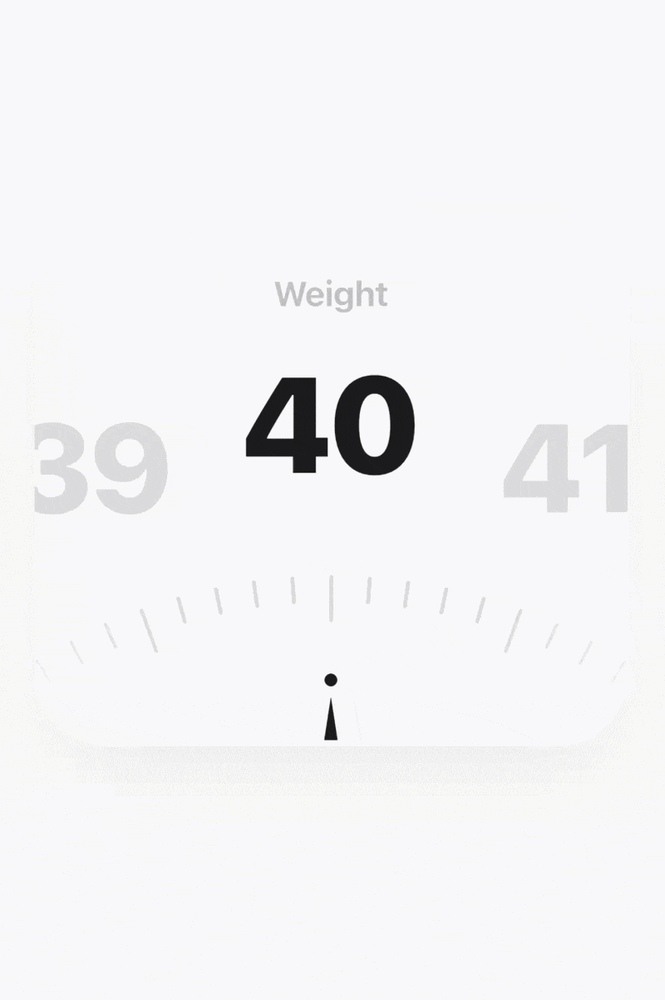
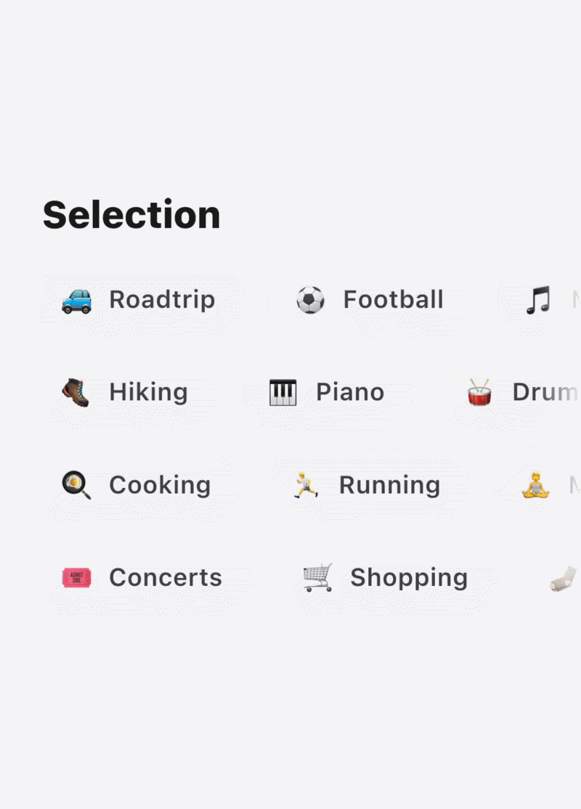
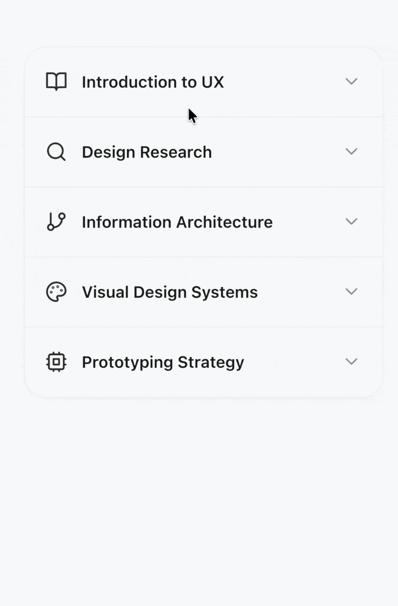
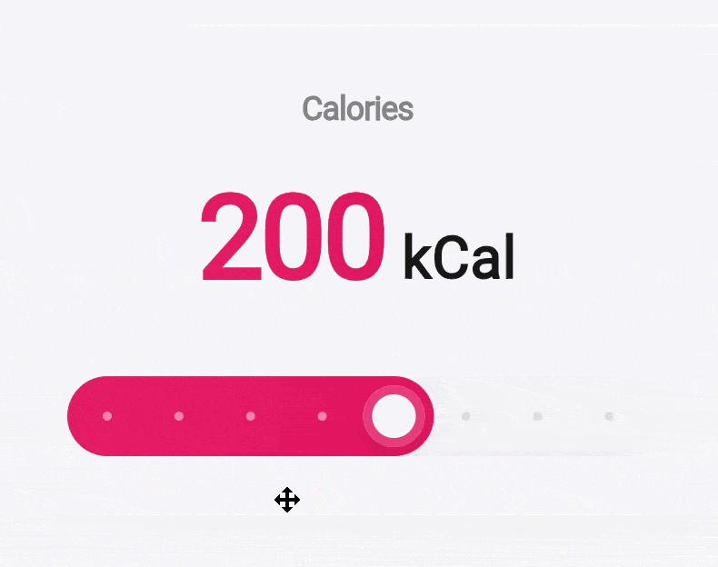
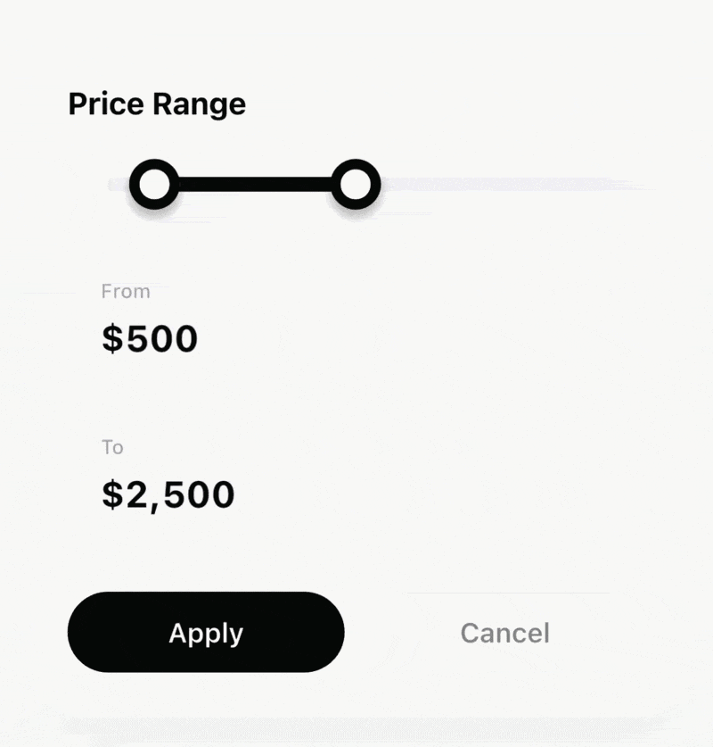

# Portal Labs

A specialized collection of **high-performance, dependency-free** Flutter UI components and advanced interactions. Built exclusively with vanilla Flutter and Dart to ensure maximum portability and long-term stability.

## Design Philosophy

The Portal Labs architecture is centered around three core pillars: **performance**, **portability**, and **visual excellence**. By adhering to a strict "zero-dependency" technical policy, we ensure that every component remains lightweight and compatible across all Flutter-supported platforms.

### Technical Constraints

To maintain a clean architecture and eliminate overhead, this repository follows these engineering standards:

*   **SDK-Only Foundation**: Components are developed using only core Flutter and Dart libraries.
*   **Internal Utilites**: Formatting, text measurement, and specialized date logic are centralized in [PortalUtils](/lib/src/common/portal_utils.dart) to avoid external packages like `intl`.
*   **Custom Design System**: Icons and typography leverage system defaults and Material Design standards, removing the need for `google_fonts` or third-party icon sets.
*   **Native Animation Engine**: Complex physics and mechanical transitions (e.g., 3D flips, magnetic snapping) are implemented using standard `AnimationController` and `Tween` sequences.

This strategy makes every component **instantly portable**—allowing developers to integrate the full library or copy individual source files without managing external versioning conflicts.

## Component Library

| Component | Description | Technical Scope | Location |
| :--- | :--- | :--- | :--- |
| **[Reveal & Copy](#reveal--copy)** | Secure data masking with scramble reveal and clipboard animation. | Interaction | `/lib/src/reveal_and_copy/` |
| **[Modern Weight Picker](#modern-weight-picker)** | Precision scrollable ruler with magnetic snapping and haptic feedback. | Numeric Input | `/lib/src/weight_picker/` |
| **[Premium Choice Chips](#premium-choice-chips)** | Animated multi-selection system with flying media transitions. | Selection | `/lib/src/premium_choice_chips/` |
| **[Journal Navigation](#journal-navigation)** | Vertical date-based navigation with 3D flip counters and snapping transitions. | Navigation | `/lib/src/journal_navigation/` |
| **[Card Splitting Accordion](#card-splitting-accordion)** | Dynamic grouping interaction with physical splitting and variable corner radii. | Layout | `/lib/src/card_splitting_accordion/` |
| **[Adaptive Slider](#adaptive-slider)** | Value-aware gradient slider with real-time color morphing. | Interaction | `/lib/src/adaptive_slider_interaction/` |
| **[Range Selection Slider](#range-selection-slider)** | Premium bi-directional range selector with mechanical Odometer-style counters and manual input support. | Selection | `/lib/src/range_selection_slider/` |

---

### Reveal & Copy


A specialized interaction designed for the secure presentation and acquisition of sensitive data (e.g., credentials, financial accounts).

#### Key Features

*   **Secure Masking**: Configurable character masking with an automated shimmer reveal effect.
*   **Timed Visibility**: Automatic reversion to masked state after a defined duration for enhanced security.
*   **Integrated Micro-interactions**: Smooth clipboard integration with visual feedback.

#### Integration

```dart
import 'package:portal_labs/portal_labs.dart';

RevealCopyInteraction(
  value: '4485 2291 0034 7516',
  onCopied: () => print('Data copied to clipboard'),
)
```

---

### Modern Weight Picker



A precision-engineered ruler interface for numeric input, optimized for tactile feedback and high-accuracy selection.

#### Key Features

*   **Custom-Painted Ruler**: High-resolution track with distinct major/minor increments.
*   **Magnetic Snapping**: Centered alignment logic that snaps to the nearest precision point.
*   **Low-Latency Feedback**: Real-time value synchronization optimized for 60fps interaction.

#### Integration

```dart
import 'package:portal_labs/portal_labs.dart';

ModernWeightPicker(
  initialValue: 75.0,
  onValueChanged: (weight) => print('Selection: $weight'),
)
```

---

### Premium Choice Chips



An engaging multi-selection component supporting diverse media types and dynamic animated transitions.

#### Key Features

*   **Media Agnostic**: Native support for Unicode emojis, Material icons, and custom images.
*   **Kinetic Transitions**: Selection events trigger a "landing" animation with flying media particles.
*   **Directional Counter**: Integrated Odometer-style counter for real-time selection tracking.

#### Integration

```dart
import 'package:portal_labs/portal_labs.dart';

PremiumChoiceChips(
  items: [
    ChoiceItem(label: 'Design', icon: Icons.palette_outlined),
    ChoiceItem(label: 'Coffee', emoji: '☕'),
  ],
  onSelectionChanged: (selected) => print('Selected count: ${selected.length}'),
)
```

---

### Journal Navigation


An aesthetic vertical navigation system designed for chronological content exploration and high-end journal applications.

#### Key Features

*   **Infinite Vertical Scroll**: Efficient scrolling logic supporting seamless date transitions.
*   **Direction-Aware Flips**: 3D flip animations that indicate the scroll direction (past/future).
*   **Modular Content Display**: Decoupled navigation logic allowing for any custom widget as the journal entry.

#### Integration

```dart
import 'package:portal_labs/portal_labs.dart';

JournalNavigation(
  items: [
    JournalItem(
      date: DateTime.now(),
      title: 'Project Inception',
      content: 'Core architecture finalized.',
    ),
  ],
  onDateChanged: (item) => print("Current view: ${item.title}"),
)
```

---

### Card Splitting Accordion



A sophisticated layout component where cards dynamically merge and separate based on their expansion state.

#### Key Features

*   **Physical Splitting Logic**: Cards appear to physically separate from a cohesive block into standalone units.
*   **Phase-Shifted Rounding**: Independent interpolation of corner radii and displacement for a natural feel.
*   **Adaptive Theme System**: Comprehensive style injection via the `AccordionStyle` configuration.

#### Integration

```dart
import 'package:portal_labs/portal_labs.dart';

CardSplittingAccordion(
  items: [
    AccordionItem(
      title: 'UX Strategy',
      content: 'Finalizing the vision for user-centered design systems.',
      icon: Icons.mouse_rounded,
    ),
  ],
)
```

---

### Adaptive Slider



A value-aware interaction component where the visual state adaptively morphs based on input thresholds.

#### Key Features

*   **Morphing Gradients**: Linear color interpolation across the track based on defined thresholds.
*   **Contextual Indicators**: Dynamic indicator points that recalculate their state on every frame.
*   **Gradient Typography**: Value labels share the adaptive gradient of the active track.

#### Integration

```dart
import 'package:portal_labs/portal_labs.dart';

AdaptiveSliderInteraction(
  value: _val,
  colorSteps: [
    AdaptiveColorStep(threshold: 0.0, colors: [Colors.blue, Colors.cyan]),
    AdaptiveColorStep(threshold: 1.0, colors: [Colors.red, Colors.orange]),
  ],
  onChanged: (val) => setState(() => _val = val),
)
```

---

### Range Selection Slider



A high-end range selection component featuring a stylized slider and mechanical 3D counters with manual input support.

#### Key Features

*   **Mechanical 3D Flip Counters**: Independent digit animations responding to range adjustments.
*   **Manual Input Support**: Seamlessly transition from flip counters to manual text entry on tap.
*   **Adaptive Formatting**: Built-in support for localized numeric formatting and currency symbols.

#### Integration

```dart
import 'package:portal_labs/portal_labs.dart';

RangeSelectionSlider(
  values: const RangeValues(640, 2380),
  onChanged: (values) => print("Range adjusted"),
)
```

---

## Contributing

Contributions focusing on performance optimization, new interaction patterns, or accessibility improvements are welcome. Please ensure all submissions adhere to the SDK-only dependency policy.
