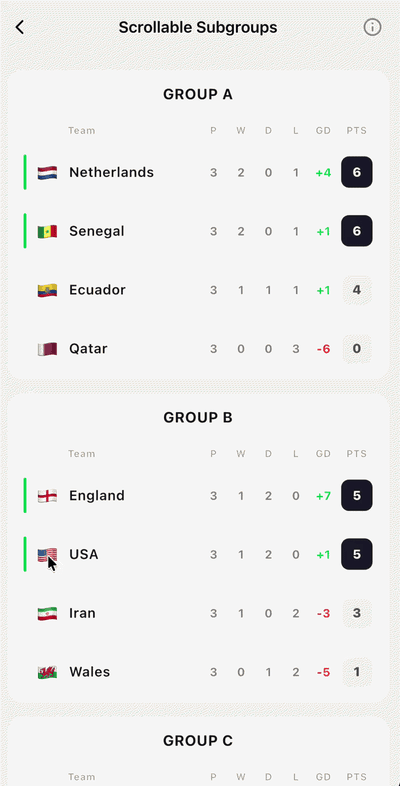

# Scrollable Subgroups



A premium scrollable list widget that groups items under sticky section headers, built entirely on Slivers.

#### Key Features

- **High-Performance Sliver Architecture**: Leverages `SliverMainAxisGroup` and `SliverPersistentHeader` to achieve highly performant, native sticky headers.
- **Collision-Aware Opacity Fade**: Animates a smooth linear fade-out of the previous group's content exactly as the next group's header collides and begins pushing it, preventing visual overlaps.
- **Dynamic Bottom Rounding**: Detects when only the sticky header remains visible in the viewport for its group, and dynamically animates its bottom corners to rounded to close the visual card.
- **Opaque Backdrop Blocking**: Wraps the sticky header in a square, background-colored container to prevent scrolling list items from showing through the rounded top corners.
- **Scroll Controller & Physics Sync**: Exposes standard scroll properties (`controller`, `physics`, `primary`, and `shrinkWrap`) to integrate cleanly with parent widgets.
- **Total Customization**: Parameterized over a generic type `<T>` and accepts custom builder callbacks for headers, non-sticky sub-headers/prefix rows, and content list items.

#### Integration

```dart
import 'package:flutter/material.dart';
import 'package:portal_labs/portal_labs.dart';

ScrollableSubgroups<TeamStats>(
  data: groups,
  style: const ScrollableSubgroupsStyle(
    headerBackgroundColor: Colors.white,
    scaffoldBackgroundColor: Color(0xFFF0F0F0),
    groupSpacing: 16.0,
    headerHeight: 48.0,
    headerTopBorderRadius: BorderRadius.only(
      topLeft: Radius.circular(16),
      topRight: Radius.circular(16),
    ),
    fadeDistance: 24.0,
  ),
  prefixItemBuilder: (context, group) => ColumnHeaderRow(group: group),
  itemBuilder: (context, team) => TeamRow(team: team),
  onChanged: (team) => handleTeamTap(team),
)
```
