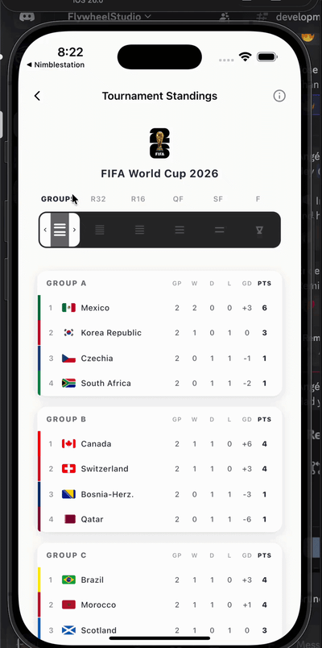

# Tournament Standings



A premium split-panel tournament standings and bracket viewer inspired by the FIFA World Cup 2026 application UI, built using pure vanilla Flutter.

#### Key Features

- **Dynamic Stage Selector**: Features a spring-animated stage tab bar highlighting selected phases (Groups, R32, R16, QF, SF, Final) with smooth sliding pill transitions.
- **Responsive Split Panels**: Maintains a left panel showcasing standings tables (detailed GP/W/D/L/GD/PTS for Group Stage, and condensed abbreviations + PTS with colored qualification bars for knockout stages).
- **Custom Bracket Connector Painter**: Draw clean orthogonally connected tree lines dynamically connecting matches across successive knockout rounds.
- **Interactive Path Highlighting**: Tapping any team highlights their advancement path and matching slots across all rounds of the tournament bracket.
- **Premium Polish & Haptics**: Implemented using custom spring animations (`PortalSpringCurve`) and lightweight haptic feedback for premium physical tactile response.

#### Integration

```dart
import 'package:flutter/material.dart';
import 'package:portal_labs/portal_labs.dart';

TournamentStandings(
  data: TournamentStandingsData(
    groups: myGroups,
    bracketMatches: myKnockoutMatches,
  ),
  style: const TournamentStandingsStyle(
    accentColor: Color(0xFF007AFF),
    connectingLineColor: Colors.grey,
    connectingLineThickness: 1.5,
    enableHaptics: true,
  ),
  onTeamTap: (team) => print('Tapped team: ${team.name}'),
  onMatchTap: (match) => print('Tapped match: ${match.id}'),
)
```

#### Advanced Use Cases

##### 1. Multi-Sport Support (e.g. Basketball, eSports)
This widget dynamically scales layout, hides flags and adapts.
- **Deactivate Flags**: If your sport doesn't require flags, simply omit `flagUrl` in `TournamentTeam` models, and the widget will render beautiful primary color indicators to the left of the team names instead.
- **Auto-adapt Stages**: If a tennis or basketball tournament has no Group Stage, the widget automatically detects and starts the layout at `R32` or `QF` based on active stages in the data.

##### 2. Double-Leg Tournaments (e.g. UEFA Champions League, Copa Libertadores)
For stages featuring home-and-away legs, you can manage scores and details elegantly:
- **Cumulative Scores**: Map the sum of both legs into `scoreA` and `scoreB` (e.g. `3` vs `2`) to keep the bracket tree progression logic correct.
- **Venue and Info Field**: Pass descriptive text in the `venue` parameter (e.g., `venue: "Leg 1: 1-2 | Leg 2: 2-0"`), which displays automatically inside the card metadata.
- **Detail Bottom Sheet**: Trigger custom detail dialogues inside the `onMatchTap` callback:
  ```dart
  onMatchTap: (match) {
    showModalBottomSheet(
      context: context,
      builder: (context) => UCLMatchDetailsSheet(match: match),
    );
  }
  ```
